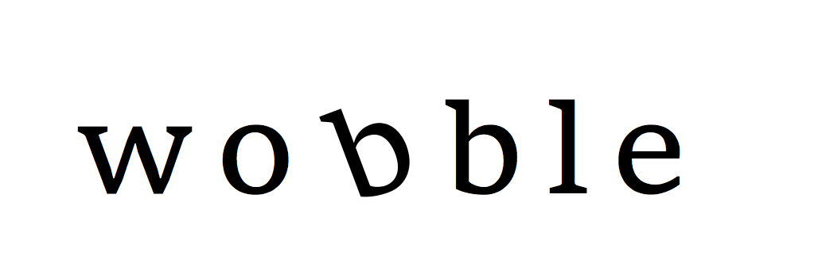

# wobble

**wobble** is a python package for deriving precise radial velocity measurements from HARPS observations. This code is still very much a work in progress, but see [docs/summary.txt](docs/summary.txt) for a semi-complete summary of what we've implemented so far!