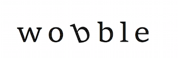

# **wobble**

**wobble** is a python package for deriving precise radial velocity measurements from HARPS observations. This code is still very much a work in progress, but see [docs/summary.txt](docs/summary.txt) for a semi-complete summary of what we've implemented so far!

## Authors
- **Megan Bedell** (Chicago)
- **David W. Hogg** (NYU) (MPIA) (Flatiron)

Binary mask located at data/G2.mas from <a href='https://ui.adsabs.harvard.edu/#abs/2017PASP..129c4002B/abstract'>Brahm et al. 2017</a>.